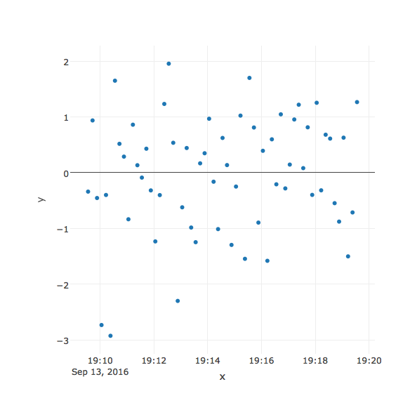
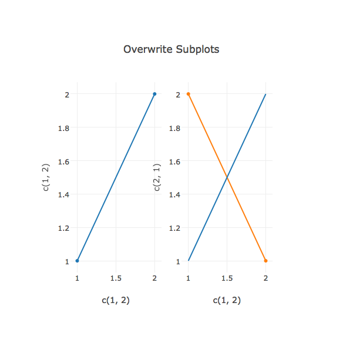

# Downloading Plotly Graphs into R


Download Plotly figures directly into R with `get_figure()`. This takes the `username` and the `plot_id` as arguments.

For example, to download [https://plot.ly/~cpsievert/559](https://plot.ly/~cpsievert/559) into R, call:


```r
library(plotly)
fig <- get_figure("cpsievert", "559")
```

<br>
Once the figure is downloaded, you can edit it like any plotly object. This will create a new figure unless you specify the same filename as the figure that you downloaded.


```r
layout(fig, title = paste("Modified on ", Sys.time()))
```

```
## Warning: 'scatter' traces don't have these attributes: '', 'family'
## Valid attributes include:
## 'font', 'title', 'titlefont', 'autosize', 'width', 'height', 'margin', 'paper_bgcolor', 'plot_bgcolor', 'separators', 'hidesources', 'smith', 'showlegend', 'dragmode', 'hovermode', 'xaxis', 'yaxis', 'scene', 'geo', 'ternary', 'mapbox', 'legend', 'annotations', 'shapes', 'images', 'updatemenus', 'radialaxis', 'angularaxis', 'direction', 'orientation', 'barmode', 'bargap'
```




```
## Warning: 'scatter' traces don't have these attributes: '', 'family'
## Valid attributes include:
## 'font', 'title', 'titlefont', 'autosize', 'width', 'height', 'margin', 'paper_bgcolor', 'plot_bgcolor', 'separators', 'hidesources', 'smith', 'showlegend', 'dragmode', 'hovermode', 'xaxis', 'yaxis', 'scene', 'geo', 'ternary', 'mapbox', 'legend', 'annotations', 'shapes', 'images', 'updatemenus', 'radialaxis', 'angularaxis', 'direction', 'orientation', 'barmode', 'bargap'
```

### Adding a trace to a subplot figure


```r
fig <- get_figure("chelsea_lyn", "6343")
add_lines(fig, x = c(1, 2), y = c(1, 2), xaxis = "x2", yaxis = "y2")
```

```
## Warning: 'scatter' traces don't have these attributes: 'enclos'
## Valid attributes include:
## 'font', 'title', 'titlefont', 'autosize', 'width', 'height', 'margin', 'paper_bgcolor', 'plot_bgcolor', 'separators', 'hidesources', 'smith', 'showlegend', 'dragmode', 'hovermode', 'xaxis', 'yaxis', 'scene', 'geo', 'ternary', 'mapbox', 'legend', 'annotations', 'shapes', 'images', 'updatemenus', 'radialaxis', 'angularaxis', 'direction', 'orientation', 'barmode', 'bargap'
```

```
## Warning: 'scatter' traces don't have these attributes: 'inherit'
## Valid attributes include:
## 'type', 'visible', 'showlegend', 'legendgroup', 'opacity', 'name', 'uid', 'hoverinfo', 'stream', 'x', 'x0', 'dx', 'y', 'y0', 'dy', 'ids', 'text', 'mode', 'hoveron', 'line', 'connectgaps', 'fill', 'fillcolor', 'marker', 'textposition', 'textfont', 'r', 't', 'error_y', 'error_x', 'xaxis', 'yaxis', 'xsrc', 'ysrc', 'idssrc', 'textsrc', 'textpositionsrc', 'rsrc', 'tsrc', 'key'

## Warning: 'scatter' traces don't have these attributes: 'inherit'
## Valid attributes include:
## 'type', 'visible', 'showlegend', 'legendgroup', 'opacity', 'name', 'uid', 'hoverinfo', 'stream', 'x', 'x0', 'dx', 'y', 'y0', 'dy', 'ids', 'text', 'mode', 'hoveron', 'line', 'connectgaps', 'fill', 'fillcolor', 'marker', 'textposition', 'textfont', 'r', 't', 'error_y', 'error_x', 'xaxis', 'yaxis', 'xsrc', 'ysrc', 'idssrc', 'textsrc', 'textpositionsrc', 'rsrc', 'tsrc', 'key'
```




```
## Warning: 'scatter' traces don't have these attributes: 'enclos'
## Valid attributes include:
## 'font', 'title', 'titlefont', 'autosize', 'width', 'height', 'margin', 'paper_bgcolor', 'plot_bgcolor', 'separators', 'hidesources', 'smith', 'showlegend', 'dragmode', 'hovermode', 'xaxis', 'yaxis', 'scene', 'geo', 'ternary', 'mapbox', 'legend', 'annotations', 'shapes', 'images', 'updatemenus', 'radialaxis', 'angularaxis', 'direction', 'orientation', 'barmode', 'bargap'
```

```
## Warning: 'scatter' traces don't have these attributes: 'inherit'
## Valid attributes include:
## 'type', 'visible', 'showlegend', 'legendgroup', 'opacity', 'name', 'uid', 'hoverinfo', 'stream', 'x', 'x0', 'dx', 'y', 'y0', 'dy', 'ids', 'text', 'mode', 'hoveron', 'line', 'connectgaps', 'fill', 'fillcolor', 'marker', 'textposition', 'textfont', 'r', 't', 'error_y', 'error_x', 'xaxis', 'yaxis', 'xsrc', 'ysrc', 'idssrc', 'textsrc', 'textpositionsrc', 'rsrc', 'tsrc', 'key'

## Warning: 'scatter' traces don't have these attributes: 'inherit'
## Valid attributes include:
## 'type', 'visible', 'showlegend', 'legendgroup', 'opacity', 'name', 'uid', 'hoverinfo', 'stream', 'x', 'x0', 'dx', 'y', 'y0', 'dy', 'ids', 'text', 'mode', 'hoveron', 'line', 'connectgaps', 'fill', 'fillcolor', 'marker', 'textposition', 'textfont', 'r', 't', 'error_y', 'error_x', 'xaxis', 'yaxis', 'xsrc', 'ysrc', 'idssrc', 'textsrc', 'textpositionsrc', 'rsrc', 'tsrc', 'key'
```

### Restyle traces

It's easy to add a trace or change the layout of figure, but it's a bit more challenging to modify attributes of an existing trace. If you know the attribute you want to change, and the trace number (starting with 1), use the `style()` function. For example, we could remove the hover text from [this plot](https://plot.ly/~RPlotBot/2833) like so:


```r
fig <- get_figure("rplotbot", 2833)
fig %>% 
  style(hoverinfo = "none") %>% 
  layout(title = "No hover text")
```

```
## Warning: 'scatter' traces don't have these attributes: 'inherit', 'sizesrc', 'size'
## Valid attributes include:
## 'type', 'visible', 'showlegend', 'legendgroup', 'opacity', 'name', 'uid', 'hoverinfo', 'stream', 'x', 'x0', 'dx', 'y', 'y0', 'dy', 'ids', 'text', 'mode', 'hoveron', 'line', 'connectgaps', 'fill', 'fillcolor', 'marker', 'textposition', 'textfont', 'r', 't', 'error_y', 'error_x', 'xaxis', 'yaxis', 'xsrc', 'ysrc', 'idssrc', 'textsrc', 'textpositionsrc', 'rsrc', 'tsrc', 'key'

## Warning: 'scatter' traces don't have these attributes: 'inherit', 'sizesrc', 'size'
## Valid attributes include:
## 'type', 'visible', 'showlegend', 'legendgroup', 'opacity', 'name', 'uid', 'hoverinfo', 'stream', 'x', 'x0', 'dx', 'y', 'y0', 'dy', 'ids', 'text', 'mode', 'hoveron', 'line', 'connectgaps', 'fill', 'fillcolor', 'marker', 'textposition', 'textfont', 'r', 't', 'error_y', 'error_x', 'xaxis', 'yaxis', 'xsrc', 'ysrc', 'idssrc', 'textsrc', 'textpositionsrc', 'rsrc', 'tsrc', 'key'
```


```
## Warning: 'scatter' traces don't have these attributes: 'inherit', 'sizesrc', 'size'
## Valid attributes include:
## 'type', 'visible', 'showlegend', 'legendgroup', 'opacity', 'name', 'uid', 'hoverinfo', 'stream', 'x', 'x0', 'dx', 'y', 'y0', 'dy', 'ids', 'text', 'mode', 'hoveron', 'line', 'connectgaps', 'fill', 'fillcolor', 'marker', 'textposition', 'textfont', 'r', 't', 'error_y', 'error_x', 'xaxis', 'yaxis', 'xsrc', 'ysrc', 'idssrc', 'textsrc', 'textpositionsrc', 'rsrc', 'tsrc', 'key'
```

You'll probably want to inspect the traces before you use this function, and I recommend using the `plotly_json()` function to do so.
