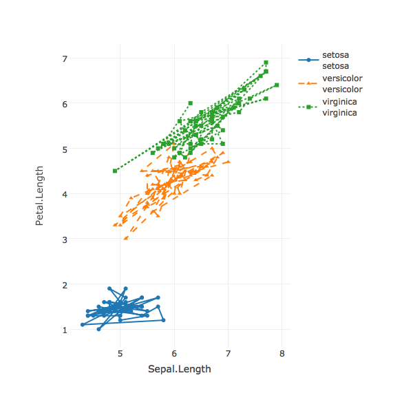
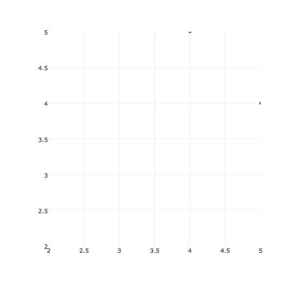
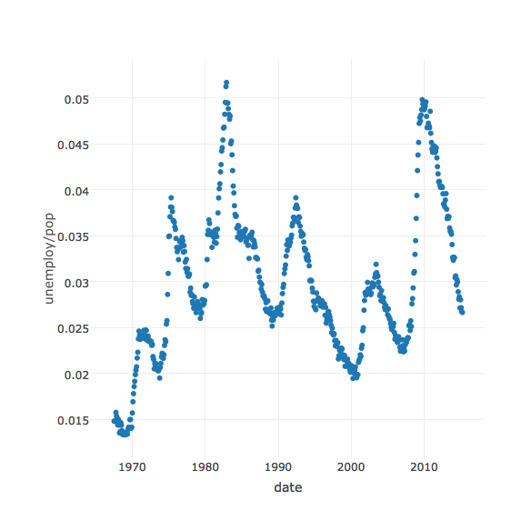
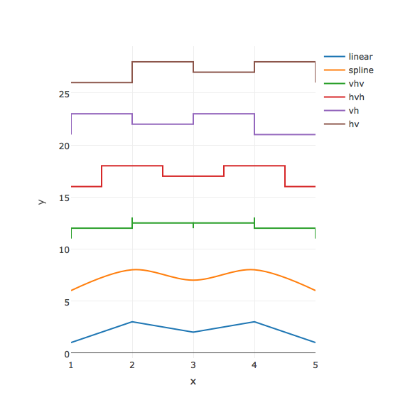

# Line and Scatter Plots in R

### Simple scatterplot


```r
library(plotly)
p <- plot_ly(data = iris, x = ~Sepal.Length, y = ~Petal.Length)
p
```


### Scatter Plot with Qualitative Colorscale


```r
add_markers(p, color = ~Species)
```


### ColorBrewer Palette Names


```r
add_markers(p, color = ~Species, colors = "Set1")
```


### Custom Color Scales

The `colors` argument also accepts a character vector of any valid R color code(s).


```r
pal <- c("red", "blue", "green")
add_markers(p, color = ~Species, colors = pal)
```


To ensure a particular data value gets mapped to particular color, provide a character vector of color codes, and match the names attribute accordingly.


```r
pal <- setNames(pal, c("virginica", "setosa", "versicolor"))
add_markers(p, color = ~Species, colors = pal)
```


### Plotting markers and lines, efficiently


```r
add_trace(p, color = ~Species, mode = "markers+lines")
```


## Mapping data to symbol and linetype


```r
add_trace(p, symbol = ~Species, linetype = ~Species)
```




### Adding Color and Size Mapping


```r
d <- diamonds[sample(nrow(diamonds), 1000), ]
plot_ly(
  d, x = ~carat, y = ~price,
  text = ~paste("Clarity: ", clarity),
  color = ~carat, size = ~carat
)
```




### Density Plot


```r
dens <- with(diamonds, tapply(price, INDEX = cut, density))
df <- data.frame(
  x = unlist(lapply(dens, "[[", "x")),
  y = unlist(lapply(dens, "[[", "y")),
  cut = rep(names(dens), each = length(dens[[1]]$x))
)
plot_ly(df, x = ~x, y = ~y, color = ~cut) %>%
  add_lines()
```




### Line Interpolation Options


```r
x <- 1:5
y <- c(1, 3, 2, 3, 1)
plot_ly(x = ~x) %>%
  add_lines(y = ~y, name = "linear", line = list(shape = "linear")) %>%
  add_lines(y = y + 5, name = "spline", line = list(shape = "spline")) %>%
  add_lines(y = y + 10, name = "vhv", line = list(shape = "vhv")) %>%
  add_lines(y = y + 15, name = "hvh", line = list(shape = "hvh")) %>%
  add_lines(y = y + 20, name = "vh", line = list(shape = "vh")) %>%
  add_lines(y = y + 25, name = "hv", line = list(shape = "hv"))
```




