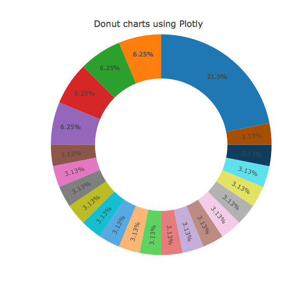

# USA Flight Paths Map


```r
library(plotly)
library(dplyr)
# airport locations
air <- read.csv('https://raw.githubusercontent.com/plotly/datasets/master/2011_february_us_airport_traffic.csv')
# flights between airports
flights <- read.csv('https://raw.githubusercontent.com/plotly/datasets/master/2011_february_aa_flight_paths.csv')
flights$id <- seq_len(nrow(flights))

# map projection
geo <- list(
  scope = 'north america',
  projection = list(type = 'azimuthal equal area'),
  showland = TRUE,
  landcolor = toRGB("gray95"),
  countrycolor = toRGB("gray80")
)

plot_ly(locationmode = 'USA-states', color = I("red")) %>%
  add_scattergeo(
    data = air, lon = ~long, lat = ~lat, text = ~airport,
    size = ~cnt, mode = "markers", hoverinfo = "text", alpha = 0.5
  ) %>%
  add_scattergeo(
    data = group_by(flights, id),
    lat = ~c(start_lat, end_lat),
    lon = ~c(start_lon, end_lon),
    alpha = 0.3, size = I(1),
    mode = 'lines', hoverinfo = "none"
  ) %>%
  layout(
    title = 'Feb. 2011 American Airline flight paths<br>(Hover for airport names)',
    geo = geo, showlegend = FALSE, height=800
  ) 
```


### London to NYC Great Circle


```r
library(plotly)
plot_ly(lat = c(40.7127, 51.5072), lon = c(-74.0059, 0.1275)) %>%
  add_scattergeo(mode = 'lines', color = I("blue"), size = I(2)) %>%
  layout(
    title = 'London to NYC Great Circle',
    showlegend = FALSE,
    geo = list(
      resolution = 50,
      showland = TRUE,
      showlakes = TRUE,
      landcolor = toRGB("grey80"),
      countrycolor = toRGB("grey80"),
      lakecolor = toRGB("white"),
      projection = list(type = "equirectangular"),
      coastlinewidth = 2,
      lataxis = list(
        range = c(20, 60),
        showgrid = TRUE,
        tickmode = "linear",
        dtick = 10
      ),
      lonaxis = list(
        range = c(-100, 20),
        showgrid = TRUE,
        tickmode = "linear",
        dtick = 20
      )
    )
  )
```


### Contour lines on globe


```r
df <- read.csv('https://raw.githubusercontent.com/plotly/datasets/master/globe_contours.csv')
df$id <- seq_len(nrow(df))

library(tidyr)
d <- df %>%
  gather(key, value, -id) %>%
  separate(key, c("l", "line"), "\\.") %>%
  spread(l, value)

geo <- list(
  showland = TRUE,
  showlakes = TRUE,
  showcountries = TRUE,
  showocean = TRUE,
  countrywidth = 0.5,
  landcolor = toRGB("grey90"),
  lakecolor = toRGB("white"),
  oceancolor = toRGB("white"),
  projection = list(
    type = 'orthographic',
    rotation = list(
      lon = -100,
      lat = 40,
      roll = 0
    )
  ),
  lonaxis = list(
    showgrid = TRUE,
    gridcolor = toRGB("gray40"),
    gridwidth = 0.5
  ),
  lataxis = list(
    showgrid = TRUE,
    gridcolor = toRGB("gray40"),
    gridwidth = 0.5
  )
)

plot_ly(d, lat = ~lat, lon = ~lon) %>%
  group_by(line) %>%
  add_scattergeo() %>%
  layout(
    showlegend = FALSE, geo = geo,
    title = 'Contour lines over globe<br>(Click and drag to rotate)'
  )
```




