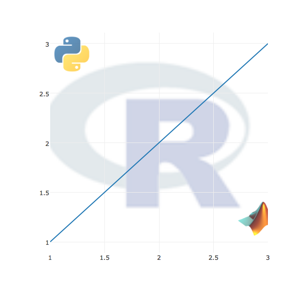

# Privacy Settings in R

Since Version 2.0 (November 15, 2015), Plotly for R renders entirely locally by default, but you can also publish these graphs to the web via the `plotly_POST()` function. By default, `plotly_POST()` creates public graphs (which are free to create), but with a [plotly subscription](https://plot.ly/products/cloud/) you can easily make them private via the `sharing` argument.


```r
library(plotly)
plot_ly(x = c(0, 2, 4), y = c(0, 4, 2))
```




```r
plotly_POST(filename = "r-docs/public-graph")
```


```r
# returns a "secret" url that points to your graph
plotly_POST(filename = "r-docs/private-graph", sharing = "secret")
# only those logged into your paying account can view result
plotly_POST(filename = "r-docs/private-graph", sharing = "private")
```
