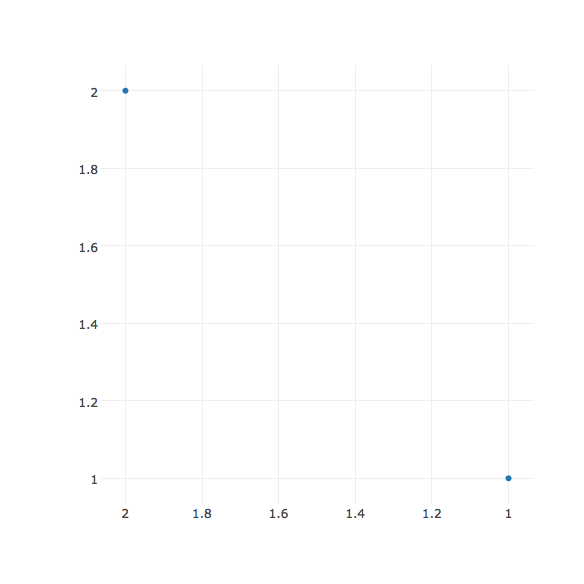
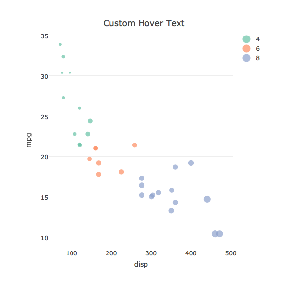

# Adding Text and Annotations in R

### Text Mode


```r
library(plotly)
plot_ly(mtcars, x = ~wt, y = ~mpg, text = rownames(mtcars)) %>%
  add_text()
```


### Hover Text


```r
plot_ly(mtcars, x = ~wt, y = ~mpg, text = rownames(mtcars)) %>%
  add_markers()
```


### Styling Text


```r
t <- list(
  family = "sans serif",
  size = 18,
  color = toRGB("grey50")
)
plot_ly(mtcars, x = ~wt, y = ~mpg, text = rownames(mtcars)) %>%
  add_markers() %>%
  add_text(textfont = t, textposition = "top middle")
```


### Single Annotation


```r
m <- mtcars[which.max(mtcars$mpg), ]

a <- list(
  x = m$wt,
  y = m$mpg,
  text = rownames(m),
  xref = "x",
  yref = "y",
  showarrow = TRUE,
  arrowhead = 7,
  ax = 20,
  ay = -40
)

plot_ly(mtcars, x = ~wt, y = ~mpg) %>%
  add_markers() %>%
  layout(annotations = a)
```


### Multiple Annotations


```r
a <- list()
for (i in seq_len(nrow(mtcars))) {
  m <- mtcars[i, ]
  a[[i]] <- list(
    x = m$wt,
    y = m$mpg,
    text = rownames(m),
    xref = "x",
    yref = "y",
    showarrow = TRUE,
    arrowhead = 7,
    ax = 20,
    ay = -40
  )
}

plot_ly(mtcars, x = ~wt, y = ~mpg) %>%
  add_markers() %>%
  layout(annotations = a)
```




### Custom Hover Text


```r
mtcars %>% 
  plot_ly(x = ~disp, y = ~mpg, color = ~factor(cyl), size = ~wt) %>%
  add_markers(
    hoverinfo = "text",
    text = ~paste("Displacement = ", disp, "Miles Per Gallon = ", mpg)
  ) %>% 
  layout(title ="Custom Hover Text")
```




