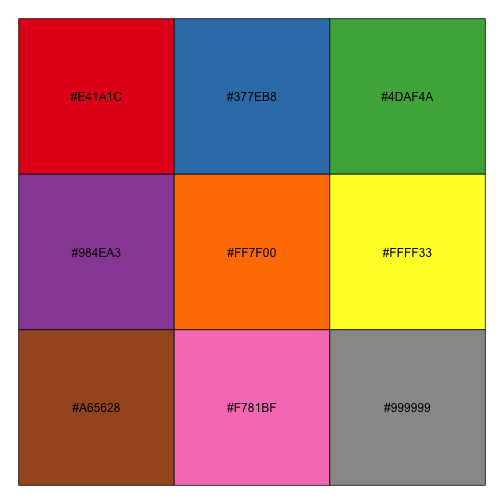

## Plotly for R User Guide


Plotly is an R package for creating interactive web-based graphs via the open source JavaScript graphing library [plotly.js](http://plot.ly/javascript). As of version 2.0 (November 17, 2015), Plotly graphs are rendered *locally* through the [htmlwidgets](http://www.htmlwidgets.org/) framework.

To create a plotly visualization, start with `plot_ly()`. Your graph will appear in your web browser or in RStudio's viewer.


```r
library(plotly)
p <- plot_ly(economics, x = date, y = unemploy / pop)
p
```
<iframe style="border: none; width: 100%; height: 550px" src="https://plot.ly/~RPlotBot/2714.embed"></iframe>

If you want to publish your graphs to the web, you can host your graphs in an online plotly account with `plotly_POST`. [Learn more about hosting graphs on Plotly](https://plot.ly/r/getting-started).


```r
library(plotly)
p <- plot_ly(economics, x = date, y = unemploy / pop)
plotly_POST(p, filename="r-user-guide/publishing-example")
```

A plotly visualization is composed of one (or more) trace(s), and every trace has a `type` (the default type is 'scatter'). The arguments or properties that a trace will respect ([documented here](https://plot.ly/r/reference)) depend on its type. A scatter trace respects `mode`, which can be any combination of "lines", "markers", "text" joined with a "+":


```r
library(plotly)
p <- plot_ly(economics, x = date, y = unemploy / pop,
             type = "scatter", mode = "markers+lines")
p
```
<iframe style="border: none; width: 100%; height: 550px" src="https://plot.ly/~RPlotBot/2718.embed"></iframe>


You can manually add a trace to an existing plot with `add_trace()`. In that case, you'll want to either `name` your traces, or hide the legend by setting `showlegend = FALSE`


```r
m <- loess(unemploy / pop ~ as.numeric(date), data = economics)
p <- plot_ly(economics, x = date, y = unemploy / pop, name = "raw")
p <- add_trace(p, y = fitted(m), name = "loess")
p
```
<iframe style="border: none; width: 100%; height: 550px" src="https://plot.ly/~RPlotBot/2720.embed"></iframe>

__plotly__ was designed with a [pure, predictable, and pipeable interface](https://dl.dropboxusercontent.com/u/41902/pipe-dsls.pdf) in mind, so you can also use the `%>%` operator to modify your plots:


```r
p <- economics %>%
  plot_ly(x = date, y = unemploy / pop) %>%
  add_trace(y = fitted(m)) %>%
  layout(showlegend = F)
p
```
<iframe style="border: none; width: 100%; height: 550px" src="https://plot.ly/~RPlotBot/2722.embed"></iframe>

Furthermore, `plot_ly()`, `add_trace()`, and `layout()`, all accept a data frame as their first argument and output a data frame. As a result, we can inter-weave data manipulations and visual mappings in a single pipeline.


```r
p <- economics %>%
  transform(rate = unemploy / pop) %>%
  plot_ly(x = date, y = rate) %>%
  subset(rate == max(rate)) %>%
  layout(
    showlegend = F,
    annotations = list(x = date, y = rate, text = "Peak", showarrow = T)
  )
p
```
<iframe style="border: none; width: 100%; height: 550px" src="https://plot.ly/~RPlotBot/2724.embed"></iframe>

Although these functions output special "plotly data frames", `plot_ly()` doesn't require a data frame for input. This makes chart types that accept a `z` argument especially easy to use if you have a numeric matrix:


```r
p <- plot_ly(z = volcano, type = "surface")
p
```
<iframe style="border: none; width: 100%; height: 550px" src="https://plot.ly/~RPlotBot/2726.embed"></iframe>

```r
p <- plot_ly(z = volcano, type = "contour")
p
```
<iframe style="border: none; width: 100%; height: 550px" src="https://plot.ly/~RPlotBot/2728.embed"></iframe>

## Special arguments

The __plotly__ function arguments used thus far are documented in [the figure reference](https://plot.ly/r/reference), but there are a handful of additional arguments not described in the reference that make common visualizations a bit easier. These arguments are very much inspired by the semantics of ggplot2's `qplot()` in the sense that a scales are automatically applied these variables.

### The color argument

#### Qualitative color mappings

If a ordinal variable (aka a non-ordered factor variable) is assigned to color, then a qualitative color palette is used by default.


```r
p <- plot_ly(iris, x = Petal.Length, y = Petal.Width,
             color = Species, mode = "markers")
```
<iframe style="border: none; width: 100%; height: 550px" src="https://plot.ly/~RPlotBot/2730.embed"></iframe>

If you want to change the default palette, it's recommended that you provide a <http://colorbrewer2.org> qualitative pallette name (e.g., "Set1" or "Accent") to the colors argument.


```r
p <- plot_ly(iris, x = Petal.Length, y = Petal.Width,
             color = Species, colors = "Set1", mode = "markers")
```
<iframe style="border: none; width: 100%; height: 550px" src="https://plot.ly/~RPlotBot/2732.embed"></iframe>

In this case, the palette consists of 9 colors and the default behavior is to pick colors that are furthest apart ("#E41A1C", "#FF7F00", and "#999999").

 

If you'd like more control over the mapping, you can provide a vector of colors (of appropriate length).


```r
cols <- RColorBrewer::brewer.pal(nlevels(iris$Species), "Set1")
p <- plot_ly(iris, x = Petal.Length, y = Petal.Width,
             color = Species, colors = cols, mode = "markers")
p
```
<iframe style="border: none; width: 100%; height: 550px" src="https://plot.ly/~RPlotBot/2734.embed"></iframe>


#### Sequential color mappings

If either a numeric or an ordered factor is mapped to color, `plot_ly()` applies a sequential color scale by default.


```r
p <- plot_ly(iris, x = Petal.Length, y = Petal.Width,
             color = as.ordered(Species), mode = "markers")
```
<iframe style="border: none; width: 100%; height: 550px" src="https://plot.ly/~RPlotBot/2736.embed"></iframe>

In the case of continuous numeric variables, `plot_ly()` performs a linear mapping between the data and an interpolated color pallette.


```r
p <- plot_ly(iris, x = Petal.Length, y = Petal.Width,
             color = Sepal.Length, mode = "markers")
```
<iframe style="border: none; width: 100%; height: 550px" src="https://plot.ly/~RPlotBot/2738.embed"></iframe>

The colors argument takes arbitrary color codes of arbitrary length. Here is how we could use it to replicate the default mapping in ggplot2.


```r
p <- plot_ly(iris, x = Petal.Length, y = Petal.Width,
             color = Sepal.Length, colors = c("#132B43", "#56B1F7"),
             mode = "markers")
```
<iframe style="border: none; width: 100%; height: 550px" src="https://plot.ly/~RPlotBot/2740.embed"></iframe>

#### Diverging color mappings

To obtain a diverging color mapping, just provide a diverging palette to the colors argument.


```r
p <- plot_ly(iris, x = Petal.Length, y = Petal.Width,
             color = Sepal.Length, colors = "PuOr", mode = "markers")
```
<iframe style="border: none; width: 100%; height: 550px" src="https://plot.ly/~RPlotBot/2742.embed"></iframe>

### The symbol argument

To encode values using symbols, use the symbol argument.


```r
p <- plot_ly(iris, x = Petal.Length, y = Petal.Width,
             symbol = Species, mode = "markers")
```
<iframe style="border: none; width: 100%; height: 550px" src="https://plot.ly/~RPlotBot/2744.embed"></iframe>

To change the default symbols used, use the symbols argument. All the valid symbol types are listed [here](https://plot.ly/r/reference/#marker).


```r
p <- plot_ly(iris, x = Petal.Length, y = Petal.Width, mode = "markers",
             symbol = Species, symbols = c("cross", "square", "triangle-down"))
```
<iframe style="border: none; width: 100%; height: 550px" src="https://plot.ly/~RPlotBot/2746.embed"></iframe>

### The group argument and `subplot()`

Using the group argument splits the data into different plotly "traces".


```r
p <- plot_ly(iris, x = Petal.Length, y = Petal.Width,
             group = Species, mode = "markers")
```
<iframe style="border: none; width: 100%; height: 550px" src="https://plot.ly/~RPlotBot/2748.embed"></iframe>

Although we haven't specified a coloring scheme, plotly will employ one on it's own default scheme. The group argument is quite powerful when used in conjunction with `subplot()` in order to anchor traces onto different axes.


```r
iris$id <- as.integer(iris$Species)
p <- plot_ly(iris, x = Petal.Length, y = Petal.Width, group = Species,
             xaxis = paste0("x", id), mode = "markers")
p2 <- subplot(p)
p2
```
<iframe style="border: none; width: 100%; height: 550px" src="https://plot.ly/~RPlotBot/2750.embed"></iframe>

Since `subplot()` does not assume x/y axes are on a common scale, it does not impose any restrictions on the range by default. However, you can change this by pre-specifying the range of the [axis objects](https://plot.ly/r/reference/#xaxis) via the `layout()` function.


```r
p2 <- layout(
  p,
  xaxis = list(range = range(Petal.Length) + c(-0.1, 0.1)),
  yaxis = list(range = range(Petal.Width) + c(-0.1, 0.1))
)
p2 <- subplot(p2)
p2
```
<iframe style="border: none; width: 100%; height: 550px" src="https://plot.ly/~RPlotBot/2752.embed"></iframe>


Part of the magic of `subplot()` is that it generates axis objects with appropriate anchor and domain properties. After generating a subplot, you can always reference these axis objects to customize each plot.


```r
p2 <- layout(
    subplot(p),
    yaxis2 = list(title = ""),
    yaxis3 = list(title = "")
)
p2
```
<iframe style="border: none; width: 100%; height: 550px" src="https://plot.ly/~RPlotBot/2754.embed"></iframe>


[See here](https://plot.ly/r/map-subplots-and-small-multiples/) for another example of using the group argument to make small multiples (with maps!).
