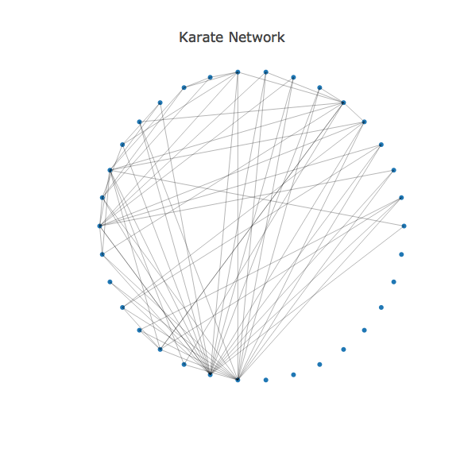

# Network Graphs in R

##### We are using the well-known social network of `Zachary's karate club`. GML format file can be collected from [here](https://gist.github.com/pravj/9168fe52823c1702a07b).

##### read graph file and update layout


```r
library(igraph)
library(plotly)

data(karate, package="igraphdata")
G <- upgrade_graph(karate)
L <- layout.circle(G)
```

##### vertices and edges for the graph

```r
vs <- V(G)
es <- as.data.frame(get.edgelist(G))
```

##### count of vertices and edges

```r
Nv <- length(vs)
Ne <- length(es[1]$V1)
```

##### node positions

```r
Xn <- L[,1]
Yn <- L[,2]
```

##### draw network nodes

```r
network <- plot_ly(x = ~Xn, y = ~Yn, mode = "markers", text = vs$label, hoverinfo = "text")
```

##### creates shapes for edges

```r
edge_shapes <- list()
for(i in 1:Ne) {
  v0 <- es[i,]$V1
  v1 <- es[i,]$V2
  
  edge_shape = list(
    type = "line",
    line = list(color = "#030303", width = 0.3),
    x0 = Xn[v0],
    y0 = Yn[v0],
    x1 = Xn[v1],
    y1 = Yn[v1]
  )
  
  edge_shapes[[i]] <- edge_shape
}
```

##### add edges to the network

```r
axis <- list(title = "", showgrid = FALSE, showticklabels = FALSE, zeroline = FALSE)

layout(
  network,
  title = 'Karate Network',
  shapes = edge_shapes,
  xaxis = axis,
  yaxis = axis
)
```




